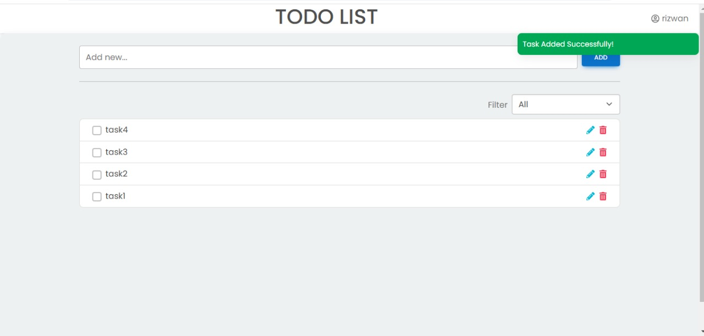

# ToDo App.

**live demo: [https://rizwan-todo-app.netlify.app](https://rizwan-todo-app.netlify.app)**

---

### Made with ❤️ by [Muhammad Rizwan](https://www.instagram.com/rizwan.herre/)

## Project Description

✨ ToDoApp: Your all-in-one task management solution! ✨

Stay organized, productive, and in control of your day with this feature-packed task manager. Built using ReactJS and powered by Firebase, ToDoApp combines a sleek, user-friendly interface with real-time functionality to keep your tasks updated across devices.

🌟 Key Features: 
✅ Effortlessly add, edit, and delete tasks
✅ Real-time updates and status management
✅ Filter tasks by "Active," "Completed," or "All"
✅ Dynamic alerts for task actions (add, edit, delete)
✅ Secure and personalized experience with Firebase Authentication

Whether you're planning your day or tracking long-term goals, ToDoApp is designed to make task management simple and effective. 🎯

💡 Ready to take your productivity to the next level? Try ToDoApp now!

## Other projects

📚 [Other Projects](https://github.com/riz-33?tab=repositories)

---

## Feedback

If you have any feedback, please reach out at [@muhammad-rizwan-quettawala](https://www.linkedin.com/in/muhammad-rizwan-quettawala-1a462b18b/)

## License

[MIT](https://choosealicense.com/licenses/mit/)

Happy Coding! 🚀